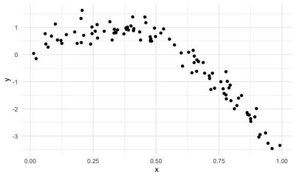
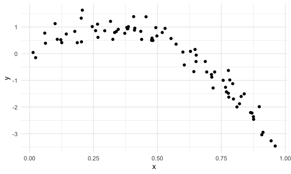
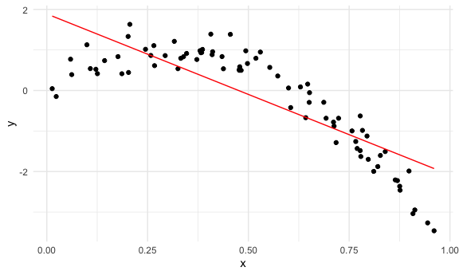
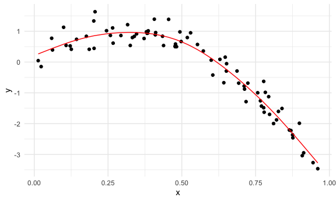
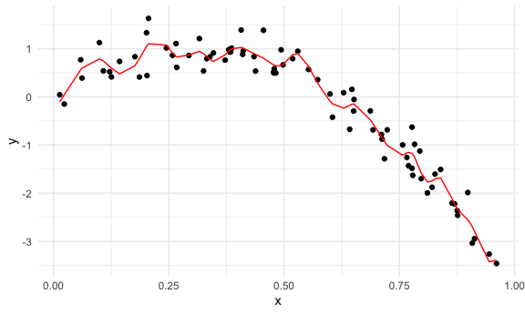
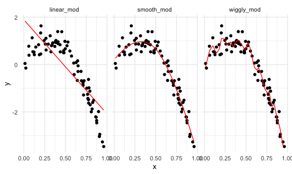
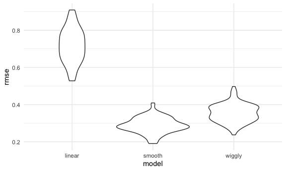
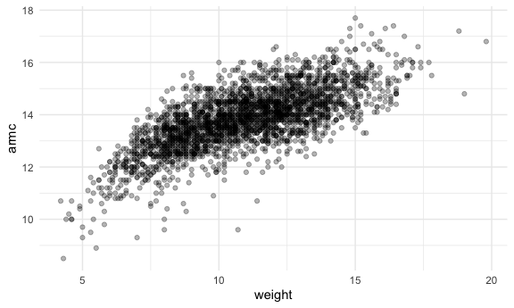
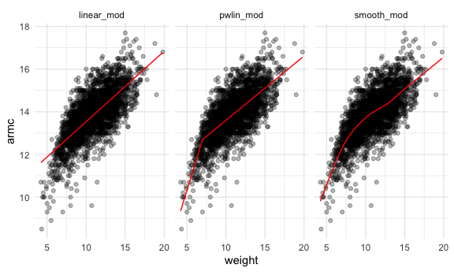
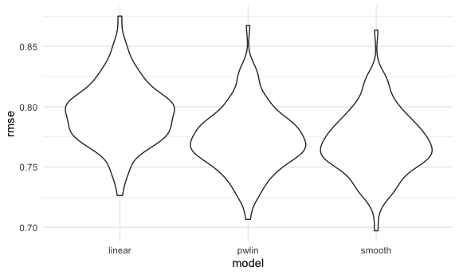

Cross validation
================

## Simulate data

``` r
nonlin_df =
  tibble(
    id = 1:100,
    x = runif(100, 0, 1),
    y = 1 - 10 * (x - .3) ^ 2 + rnorm(100, 0, .3)
  )
```

Look at the data

``` r
nonlin_df %>% 
  ggplot(aes(x = x, y = y)) +
  geom_point()
```



## Cross validation – by hand

Get training and testing datasets

``` r
train_df = sample_n(nonlin_df, size = 80)
test_df = anti_join(nonlin_df, train_df, by = "id")
```

Fit three models.

``` r
linear_mod = lm(y ~ x, data = train_df)
smooth_mod = gam(y ~ s(x), data = train_df)
wiggly_mod = gam(y ~ s(x, k = 30), sp = 10e-6, data = train_df)
```

Can I see what I just did…

``` r
train_df %>% 
  ggplot(aes(x = x, y = y)) +
  geom_point()
```



``` r
train_df %>% 
  add_predictions(linear_mod) %>% 
  ggplot(aes(x = x, y = y)) +
  geom_point() + 
  geom_line(aes(y = pred), color = "red")
```



``` r
train_df %>% 
  add_predictions(smooth_mod) %>% 
  ggplot(aes(x = x, y = y)) +
  geom_point() + 
  geom_line(aes(y = pred), color = "red")
```



``` r
train_df %>% 
  add_predictions(wiggly_mod) %>% 
  ggplot(aes(x = x, y = y)) +
  geom_point() + 
  geom_line(aes(y = pred), color = "red")
```



``` r
train_df %>% 
  gather_predictions(linear_mod, smooth_mod, wiggly_mod) %>% 
  ggplot(aes(x = x, y = y)) +
  geom_point() + 
  geom_line(aes(y = pred), color = "red") +
  facet_grid(. ~ model)
```



Look at prediction accuracy.

``` r
#look at root mean square error (rmse) between (1) the model we created with 80% of the dataset, compared to the (2) testing dataset on the 20% 

rmse(linear_mod, test_df)
```

    ## [1] 0.7052956

``` r
rmse(smooth_mod, test_df)
```

    ## [1] 0.2221774

``` r
rmse(wiggly_mod, test_df)
```

    ## [1] 0.289051

``` r
#smooth model has smallest rmse - so makes the best predictions
#next step is to reiterate a bunch of times
```

## cross validation using `modelr`

``` r
cv_df = 
  crossv_mc(nonlin_df, 100)
#cross validation 100 times
```

What is happening here…?

``` r
cv_df %>% pull(train)
```

    ## [[1]]
    ## <resample [79 x 3]> 1, 2, 3, 4, 6, 7, 8, 9, 10, 11, ...
    ## 
    ## [[2]]
    ## <resample [79 x 3]> 1, 2, 3, 4, 5, 6, 7, 8, 9, 10, ...
    ## 
    ## [[3]]
    ## <resample [79 x 3]> 1, 2, 3, 4, 5, 6, 7, 11, 12, 13, ...
    ## 
    ## [[4]]
    ## <resample [79 x 3]> 1, 4, 5, 6, 8, 9, 10, 11, 12, 13, ...
    ## 
    ## [[5]]
    ## <resample [79 x 3]> 1, 3, 4, 5, 6, 8, 9, 11, 14, 15, ...
    ## 
    ## [[6]]
    ## <resample [79 x 3]> 1, 2, 3, 5, 9, 10, 11, 12, 13, 14, ...
    ## 
    ## [[7]]
    ## <resample [79 x 3]> 1, 2, 6, 8, 9, 10, 11, 12, 13, 14, ...
    ## 
    ## [[8]]
    ## <resample [79 x 3]> 1, 4, 5, 7, 11, 12, 13, 15, 16, 17, ...
    ## 
    ## [[9]]
    ## <resample [79 x 3]> 1, 2, 3, 4, 5, 7, 8, 10, 11, 12, ...
    ## 
    ## [[10]]
    ## <resample [79 x 3]> 2, 3, 5, 6, 7, 8, 9, 10, 12, 13, ...
    ## 
    ## [[11]]
    ## <resample [79 x 3]> 1, 2, 3, 4, 5, 6, 7, 8, 9, 10, ...
    ## 
    ## [[12]]
    ## <resample [79 x 3]> 1, 2, 3, 4, 5, 6, 7, 8, 9, 10, ...
    ## 
    ## [[13]]
    ## <resample [79 x 3]> 1, 2, 4, 5, 6, 8, 9, 11, 12, 13, ...
    ## 
    ## [[14]]
    ## <resample [79 x 3]> 1, 3, 4, 5, 7, 8, 10, 11, 13, 14, ...
    ## 
    ## [[15]]
    ## <resample [79 x 3]> 1, 2, 3, 4, 5, 7, 8, 9, 10, 11, ...
    ## 
    ## [[16]]
    ## <resample [79 x 3]> 4, 5, 6, 7, 8, 9, 11, 14, 15, 16, ...
    ## 
    ## [[17]]
    ## <resample [79 x 3]> 1, 2, 3, 4, 5, 7, 9, 11, 13, 14, ...
    ## 
    ## [[18]]
    ## <resample [79 x 3]> 1, 2, 3, 4, 5, 6, 7, 9, 11, 12, ...
    ## 
    ## [[19]]
    ## <resample [79 x 3]> 1, 4, 5, 6, 10, 11, 12, 13, 14, 15, ...
    ## 
    ## [[20]]
    ## <resample [79 x 3]> 1, 2, 3, 4, 6, 7, 8, 9, 10, 12, ...
    ## 
    ## [[21]]
    ## <resample [79 x 3]> 1, 2, 3, 4, 5, 7, 8, 9, 10, 11, ...
    ## 
    ## [[22]]
    ## <resample [79 x 3]> 1, 2, 4, 5, 6, 7, 8, 9, 11, 12, ...
    ## 
    ## [[23]]
    ## <resample [79 x 3]> 1, 2, 3, 4, 5, 6, 9, 11, 12, 13, ...
    ## 
    ## [[24]]
    ## <resample [79 x 3]> 1, 2, 3, 4, 5, 6, 7, 8, 10, 12, ...
    ## 
    ## [[25]]
    ## <resample [79 x 3]> 1, 2, 3, 4, 5, 6, 7, 9, 10, 11, ...
    ## 
    ## [[26]]
    ## <resample [79 x 3]> 1, 2, 3, 4, 5, 6, 7, 8, 10, 11, ...
    ## 
    ## [[27]]
    ## <resample [79 x 3]> 1, 2, 4, 5, 6, 7, 8, 9, 10, 11, ...
    ## 
    ## [[28]]
    ## <resample [79 x 3]> 2, 4, 6, 8, 9, 10, 11, 12, 13, 14, ...
    ## 
    ## [[29]]
    ## <resample [79 x 3]> 1, 2, 3, 6, 7, 8, 9, 10, 11, 12, ...
    ## 
    ## [[30]]
    ## <resample [79 x 3]> 1, 2, 3, 4, 5, 6, 7, 9, 11, 13, ...
    ## 
    ## [[31]]
    ## <resample [79 x 3]> 1, 2, 3, 4, 5, 6, 7, 8, 9, 10, ...
    ## 
    ## [[32]]
    ## <resample [79 x 3]> 1, 2, 3, 4, 6, 7, 8, 10, 11, 12, ...
    ## 
    ## [[33]]
    ## <resample [79 x 3]> 1, 3, 4, 5, 6, 9, 10, 11, 12, 13, ...
    ## 
    ## [[34]]
    ## <resample [79 x 3]> 1, 4, 5, 7, 8, 10, 13, 14, 16, 17, ...
    ## 
    ## [[35]]
    ## <resample [79 x 3]> 2, 3, 4, 5, 6, 7, 8, 9, 10, 11, ...
    ## 
    ## [[36]]
    ## <resample [79 x 3]> 1, 2, 3, 4, 5, 7, 9, 10, 11, 13, ...
    ## 
    ## [[37]]
    ## <resample [79 x 3]> 1, 2, 3, 4, 5, 6, 7, 8, 9, 10, ...
    ## 
    ## [[38]]
    ## <resample [79 x 3]> 1, 2, 3, 4, 5, 6, 7, 8, 9, 10, ...
    ## 
    ## [[39]]
    ## <resample [79 x 3]> 2, 5, 6, 7, 8, 10, 11, 12, 14, 17, ...
    ## 
    ## [[40]]
    ## <resample [79 x 3]> 1, 2, 3, 4, 5, 6, 7, 8, 9, 11, ...
    ## 
    ## [[41]]
    ## <resample [79 x 3]> 1, 2, 3, 5, 7, 8, 9, 10, 12, 13, ...
    ## 
    ## [[42]]
    ## <resample [79 x 3]> 1, 3, 4, 5, 6, 8, 11, 13, 14, 15, ...
    ## 
    ## [[43]]
    ## <resample [79 x 3]> 1, 2, 3, 4, 5, 6, 7, 8, 10, 11, ...
    ## 
    ## [[44]]
    ## <resample [79 x 3]> 1, 2, 4, 5, 6, 7, 8, 10, 11, 13, ...
    ## 
    ## [[45]]
    ## <resample [79 x 3]> 2, 4, 5, 6, 7, 10, 11, 12, 13, 15, ...
    ## 
    ## [[46]]
    ## <resample [79 x 3]> 1, 2, 3, 4, 6, 7, 8, 9, 10, 11, ...
    ## 
    ## [[47]]
    ## <resample [79 x 3]> 1, 2, 3, 5, 7, 9, 10, 11, 13, 15, ...
    ## 
    ## [[48]]
    ## <resample [79 x 3]> 1, 3, 6, 7, 8, 9, 10, 11, 12, 13, ...
    ## 
    ## [[49]]
    ## <resample [79 x 3]> 1, 2, 3, 4, 5, 6, 8, 9, 10, 11, ...
    ## 
    ## [[50]]
    ## <resample [79 x 3]> 1, 3, 4, 5, 6, 7, 9, 10, 11, 14, ...
    ## 
    ## [[51]]
    ## <resample [79 x 3]> 1, 2, 3, 5, 6, 7, 10, 11, 12, 14, ...
    ## 
    ## [[52]]
    ## <resample [79 x 3]> 1, 2, 3, 4, 5, 6, 7, 8, 9, 10, ...
    ## 
    ## [[53]]
    ## <resample [79 x 3]> 1, 2, 3, 5, 6, 7, 9, 10, 11, 12, ...
    ## 
    ## [[54]]
    ## <resample [79 x 3]> 2, 3, 4, 5, 6, 7, 8, 9, 10, 11, ...
    ## 
    ## [[55]]
    ## <resample [79 x 3]> 2, 3, 4, 5, 7, 8, 9, 12, 13, 14, ...
    ## 
    ## [[56]]
    ## <resample [79 x 3]> 1, 3, 6, 7, 9, 10, 11, 12, 13, 14, ...
    ## 
    ## [[57]]
    ## <resample [79 x 3]> 2, 4, 6, 7, 10, 11, 12, 13, 14, 15, ...
    ## 
    ## [[58]]
    ## <resample [79 x 3]> 1, 2, 4, 5, 7, 10, 11, 14, 15, 17, ...
    ## 
    ## [[59]]
    ## <resample [79 x 3]> 1, 2, 4, 6, 7, 8, 9, 10, 11, 12, ...
    ## 
    ## [[60]]
    ## <resample [79 x 3]> 1, 2, 3, 6, 7, 8, 10, 11, 12, 14, ...
    ## 
    ## [[61]]
    ## <resample [79 x 3]> 1, 2, 3, 4, 5, 6, 8, 9, 10, 11, ...
    ## 
    ## [[62]]
    ## <resample [79 x 3]> 1, 3, 4, 5, 6, 7, 10, 11, 12, 14, ...
    ## 
    ## [[63]]
    ## <resample [79 x 3]> 1, 2, 3, 5, 8, 9, 10, 11, 12, 14, ...
    ## 
    ## [[64]]
    ## <resample [79 x 3]> 3, 4, 5, 6, 7, 8, 9, 10, 11, 12, ...
    ## 
    ## [[65]]
    ## <resample [79 x 3]> 1, 2, 3, 5, 7, 8, 9, 10, 11, 12, ...
    ## 
    ## [[66]]
    ## <resample [79 x 3]> 2, 3, 6, 7, 8, 9, 10, 11, 13, 14, ...
    ## 
    ## [[67]]
    ## <resample [79 x 3]> 1, 2, 5, 6, 7, 8, 9, 10, 13, 14, ...
    ## 
    ## [[68]]
    ## <resample [79 x 3]> 1, 2, 3, 4, 5, 6, 7, 9, 10, 11, ...
    ## 
    ## [[69]]
    ## <resample [79 x 3]> 1, 2, 3, 4, 5, 6, 7, 9, 10, 11, ...
    ## 
    ## [[70]]
    ## <resample [79 x 3]> 1, 2, 3, 4, 7, 8, 9, 10, 11, 12, ...
    ## 
    ## [[71]]
    ## <resample [79 x 3]> 3, 4, 5, 6, 7, 8, 10, 11, 12, 13, ...
    ## 
    ## [[72]]
    ## <resample [79 x 3]> 1, 3, 4, 5, 6, 8, 9, 10, 11, 12, ...
    ## 
    ## [[73]]
    ## <resample [79 x 3]> 1, 3, 6, 8, 9, 10, 11, 13, 14, 15, ...
    ## 
    ## [[74]]
    ## <resample [79 x 3]> 1, 2, 3, 4, 5, 7, 8, 9, 10, 11, ...
    ## 
    ## [[75]]
    ## <resample [79 x 3]> 1, 2, 3, 4, 5, 6, 7, 8, 9, 10, ...
    ## 
    ## [[76]]
    ## <resample [79 x 3]> 1, 3, 4, 6, 7, 8, 9, 10, 12, 13, ...
    ## 
    ## [[77]]
    ## <resample [79 x 3]> 1, 2, 3, 4, 5, 6, 8, 9, 10, 11, ...
    ## 
    ## [[78]]
    ## <resample [79 x 3]> 1, 2, 4, 6, 7, 8, 9, 10, 11, 12, ...
    ## 
    ## [[79]]
    ## <resample [79 x 3]> 1, 2, 3, 4, 5, 6, 7, 9, 10, 11, ...
    ## 
    ## [[80]]
    ## <resample [79 x 3]> 1, 2, 3, 4, 5, 7, 8, 9, 10, 11, ...
    ## 
    ## [[81]]
    ## <resample [79 x 3]> 1, 2, 4, 5, 6, 7, 8, 10, 11, 12, ...
    ## 
    ## [[82]]
    ## <resample [79 x 3]> 1, 2, 3, 4, 5, 7, 9, 10, 11, 12, ...
    ## 
    ## [[83]]
    ## <resample [79 x 3]> 1, 4, 6, 8, 9, 10, 11, 12, 13, 14, ...
    ## 
    ## [[84]]
    ## <resample [79 x 3]> 1, 2, 3, 4, 5, 7, 8, 9, 10, 12, ...
    ## 
    ## [[85]]
    ## <resample [79 x 3]> 1, 3, 5, 6, 7, 9, 10, 11, 12, 13, ...
    ## 
    ## [[86]]
    ## <resample [79 x 3]> 2, 3, 4, 5, 6, 7, 8, 9, 10, 11, ...
    ## 
    ## [[87]]
    ## <resample [79 x 3]> 1, 2, 3, 5, 6, 9, 10, 12, 13, 14, ...
    ## 
    ## [[88]]
    ## <resample [79 x 3]> 2, 3, 4, 5, 6, 7, 8, 9, 11, 12, ...
    ## 
    ## [[89]]
    ## <resample [79 x 3]> 1, 2, 4, 5, 6, 7, 8, 9, 10, 11, ...
    ## 
    ## [[90]]
    ## <resample [79 x 3]> 1, 2, 3, 4, 5, 6, 7, 8, 9, 11, ...
    ## 
    ## [[91]]
    ## <resample [79 x 3]> 1, 2, 3, 4, 5, 6, 7, 9, 10, 12, ...
    ## 
    ## [[92]]
    ## <resample [79 x 3]> 1, 2, 3, 4, 5, 6, 7, 9, 10, 11, ...
    ## 
    ## [[93]]
    ## <resample [79 x 3]> 2, 3, 4, 5, 8, 9, 10, 11, 12, 13, ...
    ## 
    ## [[94]]
    ## <resample [79 x 3]> 1, 2, 3, 4, 6, 7, 8, 9, 10, 11, ...
    ## 
    ## [[95]]
    ## <resample [79 x 3]> 1, 2, 3, 4, 5, 6, 7, 8, 9, 12, ...
    ## 
    ## [[96]]
    ## <resample [79 x 3]> 1, 3, 4, 5, 6, 7, 8, 9, 10, 11, ...
    ## 
    ## [[97]]
    ## <resample [79 x 3]> 1, 2, 3, 4, 5, 6, 7, 8, 9, 10, ...
    ## 
    ## [[98]]
    ## <resample [79 x 3]> 1, 2, 3, 4, 5, 6, 7, 8, 10, 13, ...
    ## 
    ## [[99]]
    ## <resample [79 x 3]> 1, 2, 3, 4, 5, 6, 7, 8, 9, 10, ...
    ## 
    ## [[100]]
    ## <resample [79 x 3]> 1, 2, 3, 4, 5, 6, 7, 8, 9, 10, ...

``` r
cv_df %>% pull(train) %>%  .[[1]] %>%  as_tibble()
```

    ## # A tibble: 79 x 3
    ##       id      x       y
    ##    <int>  <dbl>   <dbl>
    ##  1     1 0.266   1.11  
    ##  2     2 0.372   0.764 
    ##  3     3 0.573   0.358 
    ##  4     4 0.908  -3.04  
    ##  5     6 0.898  -1.99  
    ##  6     7 0.945  -3.27  
    ##  7     8 0.661  -0.615 
    ##  8     9 0.629   0.0878
    ##  9    10 0.0618  0.392 
    ## 10    11 0.206   1.63  
    ## # … with 69 more rows

``` r
cv_df %>% pull(test) %>%  .[[1]] %>%  as_tibble()
```

    ## # A tibble: 21 x 3
    ##       id      x      y
    ##    <int>  <dbl>  <dbl>
    ##  1     5 0.202   1.33 
    ##  2    12 0.177   0.836
    ##  3    19 0.380   0.982
    ##  4    22 0.212   0.710
    ##  5    28 0.382   0.932
    ##  6    31 0.482   0.498
    ##  7    37 0.794  -1.12 
    ##  8    42 0.647   0.158
    ##  9    47 0.0233 -0.148
    ## 10    56 0.0995  1.13 
    ## # … with 11 more rows

``` r
#you can have these as dataframes
```

``` r
cv_df =
  cv_df %>% 
  mutate(
    train = map(train, as_tibble),
    test = map(test, as_tibble)
  )
```

Let’s try to fit models and get RMSEs for them.

``` r
cv_df %>% 
  mutate(
    linear_mod = map(.x = train, ~lm(y ~ x, data = .x))
  )
```

    ## # A tibble: 100 x 4
    ##    train             test              .id   linear_mod
    ##    <list>            <list>            <chr> <list>    
    ##  1 <tibble [79 × 3]> <tibble [21 × 3]> 001   <lm>      
    ##  2 <tibble [79 × 3]> <tibble [21 × 3]> 002   <lm>      
    ##  3 <tibble [79 × 3]> <tibble [21 × 3]> 003   <lm>      
    ##  4 <tibble [79 × 3]> <tibble [21 × 3]> 004   <lm>      
    ##  5 <tibble [79 × 3]> <tibble [21 × 3]> 005   <lm>      
    ##  6 <tibble [79 × 3]> <tibble [21 × 3]> 006   <lm>      
    ##  7 <tibble [79 × 3]> <tibble [21 × 3]> 007   <lm>      
    ##  8 <tibble [79 × 3]> <tibble [21 × 3]> 008   <lm>      
    ##  9 <tibble [79 × 3]> <tibble [21 × 3]> 009   <lm>      
    ## 10 <tibble [79 × 3]> <tibble [21 × 3]> 010   <lm>      
    ## # … with 90 more rows

``` r
cv_df %>% 
  mutate(
    linear_mod = map(.x = train, ~lm(y ~ x, data = .x))
  ) %>% pull(linear_mod)
```

    ## [[1]]
    ## 
    ## Call:
    ## lm(formula = y ~ x, data = .x)
    ## 
    ## Coefficients:
    ## (Intercept)            x  
    ##       2.037       -4.265  
    ## 
    ## 
    ## [[2]]
    ## 
    ## Call:
    ## lm(formula = y ~ x, data = .x)
    ## 
    ## Coefficients:
    ## (Intercept)            x  
    ##       1.772       -3.848  
    ## 
    ## 
    ## [[3]]
    ## 
    ## Call:
    ## lm(formula = y ~ x, data = .x)
    ## 
    ## Coefficients:
    ## (Intercept)            x  
    ##       1.977       -4.178  
    ## 
    ## 
    ## [[4]]
    ## 
    ## Call:
    ## lm(formula = y ~ x, data = .x)
    ## 
    ## Coefficients:
    ## (Intercept)            x  
    ##       1.809       -3.791  
    ## 
    ## 
    ## [[5]]
    ## 
    ## Call:
    ## lm(formula = y ~ x, data = .x)
    ## 
    ## Coefficients:
    ## (Intercept)            x  
    ##       2.073       -4.286  
    ## 
    ## 
    ## [[6]]
    ## 
    ## Call:
    ## lm(formula = y ~ x, data = .x)
    ## 
    ## Coefficients:
    ## (Intercept)            x  
    ##       1.786       -3.774  
    ## 
    ## 
    ## [[7]]
    ## 
    ## Call:
    ## lm(formula = y ~ x, data = .x)
    ## 
    ## Coefficients:
    ## (Intercept)            x  
    ##       1.825       -3.929  
    ## 
    ## 
    ## [[8]]
    ## 
    ## Call:
    ## lm(formula = y ~ x, data = .x)
    ## 
    ## Coefficients:
    ## (Intercept)            x  
    ##       2.116       -4.421  
    ## 
    ## 
    ## [[9]]
    ## 
    ## Call:
    ## lm(formula = y ~ x, data = .x)
    ## 
    ## Coefficients:
    ## (Intercept)            x  
    ##       1.914       -4.086  
    ## 
    ## 
    ## [[10]]
    ## 
    ## Call:
    ## lm(formula = y ~ x, data = .x)
    ## 
    ## Coefficients:
    ## (Intercept)            x  
    ##       1.889       -3.968  
    ## 
    ## 
    ## [[11]]
    ## 
    ## Call:
    ## lm(formula = y ~ x, data = .x)
    ## 
    ## Coefficients:
    ## (Intercept)            x  
    ##       1.958       -4.115  
    ## 
    ## 
    ## [[12]]
    ## 
    ## Call:
    ## lm(formula = y ~ x, data = .x)
    ## 
    ## Coefficients:
    ## (Intercept)            x  
    ##       2.031       -4.306  
    ## 
    ## 
    ## [[13]]
    ## 
    ## Call:
    ## lm(formula = y ~ x, data = .x)
    ## 
    ## Coefficients:
    ## (Intercept)            x  
    ##       1.876       -3.898  
    ## 
    ## 
    ## [[14]]
    ## 
    ## Call:
    ## lm(formula = y ~ x, data = .x)
    ## 
    ## Coefficients:
    ## (Intercept)            x  
    ##       1.945       -4.180  
    ## 
    ## 
    ## [[15]]
    ## 
    ## Call:
    ## lm(formula = y ~ x, data = .x)
    ## 
    ## Coefficients:
    ## (Intercept)            x  
    ##       2.168       -4.466  
    ## 
    ## 
    ## [[16]]
    ## 
    ## Call:
    ## lm(formula = y ~ x, data = .x)
    ## 
    ## Coefficients:
    ## (Intercept)            x  
    ##       1.905       -4.082  
    ## 
    ## 
    ## [[17]]
    ## 
    ## Call:
    ## lm(formula = y ~ x, data = .x)
    ## 
    ## Coefficients:
    ## (Intercept)            x  
    ##       2.086       -4.355  
    ## 
    ## 
    ## [[18]]
    ## 
    ## Call:
    ## lm(formula = y ~ x, data = .x)
    ## 
    ## Coefficients:
    ## (Intercept)            x  
    ##       1.963       -4.022  
    ## 
    ## 
    ## [[19]]
    ## 
    ## Call:
    ## lm(formula = y ~ x, data = .x)
    ## 
    ## Coefficients:
    ## (Intercept)            x  
    ##       1.841       -3.993  
    ## 
    ## 
    ## [[20]]
    ## 
    ## Call:
    ## lm(formula = y ~ x, data = .x)
    ## 
    ## Coefficients:
    ## (Intercept)            x  
    ##       1.771       -3.869  
    ## 
    ## 
    ## [[21]]
    ## 
    ## Call:
    ## lm(formula = y ~ x, data = .x)
    ## 
    ## Coefficients:
    ## (Intercept)            x  
    ##       1.955       -4.081  
    ## 
    ## 
    ## [[22]]
    ## 
    ## Call:
    ## lm(formula = y ~ x, data = .x)
    ## 
    ## Coefficients:
    ## (Intercept)            x  
    ##        2.10        -4.33  
    ## 
    ## 
    ## [[23]]
    ## 
    ## Call:
    ## lm(formula = y ~ x, data = .x)
    ## 
    ## Coefficients:
    ## (Intercept)            x  
    ##       2.137       -4.339  
    ## 
    ## 
    ## [[24]]
    ## 
    ## Call:
    ## lm(formula = y ~ x, data = .x)
    ## 
    ## Coefficients:
    ## (Intercept)            x  
    ##       1.992       -4.196  
    ## 
    ## 
    ## [[25]]
    ## 
    ## Call:
    ## lm(formula = y ~ x, data = .x)
    ## 
    ## Coefficients:
    ## (Intercept)            x  
    ##       1.855       -3.858  
    ## 
    ## 
    ## [[26]]
    ## 
    ## Call:
    ## lm(formula = y ~ x, data = .x)
    ## 
    ## Coefficients:
    ## (Intercept)            x  
    ##       1.913       -4.127  
    ## 
    ## 
    ## [[27]]
    ## 
    ## Call:
    ## lm(formula = y ~ x, data = .x)
    ## 
    ## Coefficients:
    ## (Intercept)            x  
    ##       2.051       -4.317  
    ## 
    ## 
    ## [[28]]
    ## 
    ## Call:
    ## lm(formula = y ~ x, data = .x)
    ## 
    ## Coefficients:
    ## (Intercept)            x  
    ##        1.86        -3.90  
    ## 
    ## 
    ## [[29]]
    ## 
    ## Call:
    ## lm(formula = y ~ x, data = .x)
    ## 
    ## Coefficients:
    ## (Intercept)            x  
    ##       1.943       -4.094  
    ## 
    ## 
    ## [[30]]
    ## 
    ## Call:
    ## lm(formula = y ~ x, data = .x)
    ## 
    ## Coefficients:
    ## (Intercept)            x  
    ##       1.963       -4.236  
    ## 
    ## 
    ## [[31]]
    ## 
    ## Call:
    ## lm(formula = y ~ x, data = .x)
    ## 
    ## Coefficients:
    ## (Intercept)            x  
    ##       1.980       -4.227  
    ## 
    ## 
    ## [[32]]
    ## 
    ## Call:
    ## lm(formula = y ~ x, data = .x)
    ## 
    ## Coefficients:
    ## (Intercept)            x  
    ##       2.042       -4.216  
    ## 
    ## 
    ## [[33]]
    ## 
    ## Call:
    ## lm(formula = y ~ x, data = .x)
    ## 
    ## Coefficients:
    ## (Intercept)            x  
    ##       1.915       -4.070  
    ## 
    ## 
    ## [[34]]
    ## 
    ## Call:
    ## lm(formula = y ~ x, data = .x)
    ## 
    ## Coefficients:
    ## (Intercept)            x  
    ##       1.816       -3.956  
    ## 
    ## 
    ## [[35]]
    ## 
    ## Call:
    ## lm(formula = y ~ x, data = .x)
    ## 
    ## Coefficients:
    ## (Intercept)            x  
    ##       1.814       -3.829  
    ## 
    ## 
    ## [[36]]
    ## 
    ## Call:
    ## lm(formula = y ~ x, data = .x)
    ## 
    ## Coefficients:
    ## (Intercept)            x  
    ##       1.776       -3.819  
    ## 
    ## 
    ## [[37]]
    ## 
    ## Call:
    ## lm(formula = y ~ x, data = .x)
    ## 
    ## Coefficients:
    ## (Intercept)            x  
    ##       2.128       -4.376  
    ## 
    ## 
    ## [[38]]
    ## 
    ## Call:
    ## lm(formula = y ~ x, data = .x)
    ## 
    ## Coefficients:
    ## (Intercept)            x  
    ##       2.060       -4.288  
    ## 
    ## 
    ## [[39]]
    ## 
    ## Call:
    ## lm(formula = y ~ x, data = .x)
    ## 
    ## Coefficients:
    ## (Intercept)            x  
    ##       1.875       -4.060  
    ## 
    ## 
    ## [[40]]
    ## 
    ## Call:
    ## lm(formula = y ~ x, data = .x)
    ## 
    ## Coefficients:
    ## (Intercept)            x  
    ##       1.971       -4.203  
    ## 
    ## 
    ## [[41]]
    ## 
    ## Call:
    ## lm(formula = y ~ x, data = .x)
    ## 
    ## Coefficients:
    ## (Intercept)            x  
    ##       1.689       -3.672  
    ## 
    ## 
    ## [[42]]
    ## 
    ## Call:
    ## lm(formula = y ~ x, data = .x)
    ## 
    ## Coefficients:
    ## (Intercept)            x  
    ##       2.064       -4.194  
    ## 
    ## 
    ## [[43]]
    ## 
    ## Call:
    ## lm(formula = y ~ x, data = .x)
    ## 
    ## Coefficients:
    ## (Intercept)            x  
    ##       1.919       -4.168  
    ## 
    ## 
    ## [[44]]
    ## 
    ## Call:
    ## lm(formula = y ~ x, data = .x)
    ## 
    ## Coefficients:
    ## (Intercept)            x  
    ##       1.907       -4.078  
    ## 
    ## 
    ## [[45]]
    ## 
    ## Call:
    ## lm(formula = y ~ x, data = .x)
    ## 
    ## Coefficients:
    ## (Intercept)            x  
    ##       2.006       -4.195  
    ## 
    ## 
    ## [[46]]
    ## 
    ## Call:
    ## lm(formula = y ~ x, data = .x)
    ## 
    ## Coefficients:
    ## (Intercept)            x  
    ##       1.998       -4.249  
    ## 
    ## 
    ## [[47]]
    ## 
    ## Call:
    ## lm(formula = y ~ x, data = .x)
    ## 
    ## Coefficients:
    ## (Intercept)            x  
    ##       1.992       -4.166  
    ## 
    ## 
    ## [[48]]
    ## 
    ## Call:
    ## lm(formula = y ~ x, data = .x)
    ## 
    ## Coefficients:
    ## (Intercept)            x  
    ##       1.797       -3.816  
    ## 
    ## 
    ## [[49]]
    ## 
    ## Call:
    ## lm(formula = y ~ x, data = .x)
    ## 
    ## Coefficients:
    ## (Intercept)            x  
    ##       1.750       -3.807  
    ## 
    ## 
    ## [[50]]
    ## 
    ## Call:
    ## lm(formula = y ~ x, data = .x)
    ## 
    ## Coefficients:
    ## (Intercept)            x  
    ##       1.961       -4.182  
    ## 
    ## 
    ## [[51]]
    ## 
    ## Call:
    ## lm(formula = y ~ x, data = .x)
    ## 
    ## Coefficients:
    ## (Intercept)            x  
    ##       1.897       -4.038  
    ## 
    ## 
    ## [[52]]
    ## 
    ## Call:
    ## lm(formula = y ~ x, data = .x)
    ## 
    ## Coefficients:
    ## (Intercept)            x  
    ##       1.932       -4.003  
    ## 
    ## 
    ## [[53]]
    ## 
    ## Call:
    ## lm(formula = y ~ x, data = .x)
    ## 
    ## Coefficients:
    ## (Intercept)            x  
    ##       1.776       -3.726  
    ## 
    ## 
    ## [[54]]
    ## 
    ## Call:
    ## lm(formula = y ~ x, data = .x)
    ## 
    ## Coefficients:
    ## (Intercept)            x  
    ##       1.719       -3.734  
    ## 
    ## 
    ## [[55]]
    ## 
    ## Call:
    ## lm(formula = y ~ x, data = .x)
    ## 
    ## Coefficients:
    ## (Intercept)            x  
    ##        2.00        -4.17  
    ## 
    ## 
    ## [[56]]
    ## 
    ## Call:
    ## lm(formula = y ~ x, data = .x)
    ## 
    ## Coefficients:
    ## (Intercept)            x  
    ##       1.845       -3.953  
    ## 
    ## 
    ## [[57]]
    ## 
    ## Call:
    ## lm(formula = y ~ x, data = .x)
    ## 
    ## Coefficients:
    ## (Intercept)            x  
    ##       2.062       -4.357  
    ## 
    ## 
    ## [[58]]
    ## 
    ## Call:
    ## lm(formula = y ~ x, data = .x)
    ## 
    ## Coefficients:
    ## (Intercept)            x  
    ##       1.826       -3.939  
    ## 
    ## 
    ## [[59]]
    ## 
    ## Call:
    ## lm(formula = y ~ x, data = .x)
    ## 
    ## Coefficients:
    ## (Intercept)            x  
    ##       2.055       -4.222  
    ## 
    ## 
    ## [[60]]
    ## 
    ## Call:
    ## lm(formula = y ~ x, data = .x)
    ## 
    ## Coefficients:
    ## (Intercept)            x  
    ##       1.809       -3.871  
    ## 
    ## 
    ## [[61]]
    ## 
    ## Call:
    ## lm(formula = y ~ x, data = .x)
    ## 
    ## Coefficients:
    ## (Intercept)            x  
    ##       1.907       -4.047  
    ## 
    ## 
    ## [[62]]
    ## 
    ## Call:
    ## lm(formula = y ~ x, data = .x)
    ## 
    ## Coefficients:
    ## (Intercept)            x  
    ##       1.907       -4.106  
    ## 
    ## 
    ## [[63]]
    ## 
    ## Call:
    ## lm(formula = y ~ x, data = .x)
    ## 
    ## Coefficients:
    ## (Intercept)            x  
    ##       1.905       -4.015  
    ## 
    ## 
    ## [[64]]
    ## 
    ## Call:
    ## lm(formula = y ~ x, data = .x)
    ## 
    ## Coefficients:
    ## (Intercept)            x  
    ##       1.880       -4.064  
    ## 
    ## 
    ## [[65]]
    ## 
    ## Call:
    ## lm(formula = y ~ x, data = .x)
    ## 
    ## Coefficients:
    ## (Intercept)            x  
    ##       1.854       -3.964  
    ## 
    ## 
    ## [[66]]
    ## 
    ## Call:
    ## lm(formula = y ~ x, data = .x)
    ## 
    ## Coefficients:
    ## (Intercept)            x  
    ##       1.857       -4.018  
    ## 
    ## 
    ## [[67]]
    ## 
    ## Call:
    ## lm(formula = y ~ x, data = .x)
    ## 
    ## Coefficients:
    ## (Intercept)            x  
    ##       1.941       -4.118  
    ## 
    ## 
    ## [[68]]
    ## 
    ## Call:
    ## lm(formula = y ~ x, data = .x)
    ## 
    ## Coefficients:
    ## (Intercept)            x  
    ##       2.029       -4.286  
    ## 
    ## 
    ## [[69]]
    ## 
    ## Call:
    ## lm(formula = y ~ x, data = .x)
    ## 
    ## Coefficients:
    ## (Intercept)            x  
    ##       1.903       -4.156  
    ## 
    ## 
    ## [[70]]
    ## 
    ## Call:
    ## lm(formula = y ~ x, data = .x)
    ## 
    ## Coefficients:
    ## (Intercept)            x  
    ##       1.775       -3.749  
    ## 
    ## 
    ## [[71]]
    ## 
    ## Call:
    ## lm(formula = y ~ x, data = .x)
    ## 
    ## Coefficients:
    ## (Intercept)            x  
    ##       1.921       -4.128  
    ## 
    ## 
    ## [[72]]
    ## 
    ## Call:
    ## lm(formula = y ~ x, data = .x)
    ## 
    ## Coefficients:
    ## (Intercept)            x  
    ##       1.934       -4.032  
    ## 
    ## 
    ## [[73]]
    ## 
    ## Call:
    ## lm(formula = y ~ x, data = .x)
    ## 
    ## Coefficients:
    ## (Intercept)            x  
    ##       1.989       -4.018  
    ## 
    ## 
    ## [[74]]
    ## 
    ## Call:
    ## lm(formula = y ~ x, data = .x)
    ## 
    ## Coefficients:
    ## (Intercept)            x  
    ##       1.960       -4.085  
    ## 
    ## 
    ## [[75]]
    ## 
    ## Call:
    ## lm(formula = y ~ x, data = .x)
    ## 
    ## Coefficients:
    ## (Intercept)            x  
    ##       1.951       -4.105  
    ## 
    ## 
    ## [[76]]
    ## 
    ## Call:
    ## lm(formula = y ~ x, data = .x)
    ## 
    ## Coefficients:
    ## (Intercept)            x  
    ##       1.809       -3.855  
    ## 
    ## 
    ## [[77]]
    ## 
    ## Call:
    ## lm(formula = y ~ x, data = .x)
    ## 
    ## Coefficients:
    ## (Intercept)            x  
    ##       1.811       -3.871  
    ## 
    ## 
    ## [[78]]
    ## 
    ## Call:
    ## lm(formula = y ~ x, data = .x)
    ## 
    ## Coefficients:
    ## (Intercept)            x  
    ##       1.726       -3.849  
    ## 
    ## 
    ## [[79]]
    ## 
    ## Call:
    ## lm(formula = y ~ x, data = .x)
    ## 
    ## Coefficients:
    ## (Intercept)            x  
    ##       1.855       -3.924  
    ## 
    ## 
    ## [[80]]
    ## 
    ## Call:
    ## lm(formula = y ~ x, data = .x)
    ## 
    ## Coefficients:
    ## (Intercept)            x  
    ##       1.856       -3.847  
    ## 
    ## 
    ## [[81]]
    ## 
    ## Call:
    ## lm(formula = y ~ x, data = .x)
    ## 
    ## Coefficients:
    ## (Intercept)            x  
    ##       1.968       -4.169  
    ## 
    ## 
    ## [[82]]
    ## 
    ## Call:
    ## lm(formula = y ~ x, data = .x)
    ## 
    ## Coefficients:
    ## (Intercept)            x  
    ##       1.975       -4.178  
    ## 
    ## 
    ## [[83]]
    ## 
    ## Call:
    ## lm(formula = y ~ x, data = .x)
    ## 
    ## Coefficients:
    ## (Intercept)            x  
    ##       1.974       -4.062  
    ## 
    ## 
    ## [[84]]
    ## 
    ## Call:
    ## lm(formula = y ~ x, data = .x)
    ## 
    ## Coefficients:
    ## (Intercept)            x  
    ##       1.915       -4.123  
    ## 
    ## 
    ## [[85]]
    ## 
    ## Call:
    ## lm(formula = y ~ x, data = .x)
    ## 
    ## Coefficients:
    ## (Intercept)            x  
    ##       1.871       -4.063  
    ## 
    ## 
    ## [[86]]
    ## 
    ## Call:
    ## lm(formula = y ~ x, data = .x)
    ## 
    ## Coefficients:
    ## (Intercept)            x  
    ##       2.168       -4.458  
    ## 
    ## 
    ## [[87]]
    ## 
    ## Call:
    ## lm(formula = y ~ x, data = .x)
    ## 
    ## Coefficients:
    ## (Intercept)            x  
    ##       1.843       -3.911  
    ## 
    ## 
    ## [[88]]
    ## 
    ## Call:
    ## lm(formula = y ~ x, data = .x)
    ## 
    ## Coefficients:
    ## (Intercept)            x  
    ##       1.911       -3.944  
    ## 
    ## 
    ## [[89]]
    ## 
    ## Call:
    ## lm(formula = y ~ x, data = .x)
    ## 
    ## Coefficients:
    ## (Intercept)            x  
    ##       1.799       -3.907  
    ## 
    ## 
    ## [[90]]
    ## 
    ## Call:
    ## lm(formula = y ~ x, data = .x)
    ## 
    ## Coefficients:
    ## (Intercept)            x  
    ##       1.762       -3.828  
    ## 
    ## 
    ## [[91]]
    ## 
    ## Call:
    ## lm(formula = y ~ x, data = .x)
    ## 
    ## Coefficients:
    ## (Intercept)            x  
    ##       1.984       -4.186  
    ## 
    ## 
    ## [[92]]
    ## 
    ## Call:
    ## lm(formula = y ~ x, data = .x)
    ## 
    ## Coefficients:
    ## (Intercept)            x  
    ##       1.942       -4.088  
    ## 
    ## 
    ## [[93]]
    ## 
    ## Call:
    ## lm(formula = y ~ x, data = .x)
    ## 
    ## Coefficients:
    ## (Intercept)            x  
    ##       2.046       -4.118  
    ## 
    ## 
    ## [[94]]
    ## 
    ## Call:
    ## lm(formula = y ~ x, data = .x)
    ## 
    ## Coefficients:
    ## (Intercept)            x  
    ##       1.858       -4.050  
    ## 
    ## 
    ## [[95]]
    ## 
    ## Call:
    ## lm(formula = y ~ x, data = .x)
    ## 
    ## Coefficients:
    ## (Intercept)            x  
    ##       1.967       -4.172  
    ## 
    ## 
    ## [[96]]
    ## 
    ## Call:
    ## lm(formula = y ~ x, data = .x)
    ## 
    ## Coefficients:
    ## (Intercept)            x  
    ##       1.905       -4.083  
    ## 
    ## 
    ## [[97]]
    ## 
    ## Call:
    ## lm(formula = y ~ x, data = .x)
    ## 
    ## Coefficients:
    ## (Intercept)            x  
    ##       1.895       -4.097  
    ## 
    ## 
    ## [[98]]
    ## 
    ## Call:
    ## lm(formula = y ~ x, data = .x)
    ## 
    ## Coefficients:
    ## (Intercept)            x  
    ##       1.857       -4.053  
    ## 
    ## 
    ## [[99]]
    ## 
    ## Call:
    ## lm(formula = y ~ x, data = .x)
    ## 
    ## Coefficients:
    ## (Intercept)            x  
    ##       2.093       -4.342  
    ## 
    ## 
    ## [[100]]
    ## 
    ## Call:
    ## lm(formula = y ~ x, data = .x)
    ## 
    ## Coefficients:
    ## (Intercept)            x  
    ##       1.783       -3.817

``` r
cv_df = 
cv_df %>% 
  mutate(
    linear_mod = map(.x = train, ~lm(y ~ x, data = .x)),
    smooth_mod = map(.x = train, ~gam(y ~ s(x), data = .x)),
    wiggly_mod = map(.x = train, ~gam(y ~ s(x, k = 30), sp = 10e-6, data = .x))
  ) %>% 
  mutate(
    rmse_linear = map2_dbl(.x = linear_mod, .y = test, ~rmse(model = .x, data = .y)),
#.x is obtaining RMSE for "linear_mod" - unclear what .y is doing
    rmse_smooth = map2_dbl(.x = smooth_mod, .y = test, ~rmse(model = .x, data = .y)),
    rmse_wiggly = map2_dbl(.x = wiggly_mod, .y = test, ~rmse(model = .x, data = .y))
)
```

What do these results say about the model choices?

``` r
cv_df %>% 
  select(starts_with("rmse")) %>% 
  pivot_longer(
    everything(),
    names_to = "model",
    values_to = "rmse",
    names_prefix = "rmse_"
  ) %>% 
#100 cross validation training testing splits and 3 models fit to each of those splits
  ggplot(aes(x = model, y = rmse)) +
  geom_violin()
```



``` r
#This tells us linear rmse always is higher so it does worse.  Smooth and wiggly better, there is some overlap between them, but smooth is generally better than wiggly.  Smooth model is doing the best.
```

Compute average…

``` r
cv_df %>% 
  select(starts_with("rmse")) %>% 
  pivot_longer(
    everything(),
    names_to = "model",
    values_to = "rmse",
    names_prefix = "rmse_"
  ) %>% 
  group_by(model) %>% 
  summarize(avg_rmse = mean(rmse))
```

    ## `summarise()` ungrouping output (override with `.groups` argument)

    ## # A tibble: 3 x 2
    ##   model  avg_rmse
    ##   <chr>     <dbl>
    ## 1 linear    0.718
    ## 2 smooth    0.289
    ## 3 wiggly    0.354

## Try on a real dataset.

``` r
child_growth_df =
  read_csv("./data/nepalese_children.csv") %>% 
  mutate(
    weight_cp = (weight > 7) * (weight - 7)
  )
```

    ## Parsed with column specification:
    ## cols(
    ##   age = col_double(),
    ##   sex = col_double(),
    ##   weight = col_double(),
    ##   height = col_double(),
    ##   armc = col_double()
    ## )

``` r
#this is for a "change point model"
```

Weight vs arm circumference - purpose is to see how well weight predicts
arm circumference

``` r
child_growth_df %>% 
  ggplot(aes(x = weight, y = armc)) +
  geom_point(alpha = .3)
```



Fit the models I care about.

``` r
linear_mod = lm(armc ~ weight, data = child_growth_df)
pwlin_mod = lm(armc ~ weight + weight_cp, data = child_growth_df)
smooth_mod = gam(armc ~ s(weight), data = child_growth_df)
```

``` r
child_growth_df %>% 
  gather_predictions(linear_mod, pwlin_mod, smooth_mod) %>% 
  ggplot(aes(x = weight, y = armc)) +
  geom_point(alpha = .3) + 
  geom_line(aes(y = pred), color = "red") + 
  facet_grid(. ~ model)
```



Which of these models is the best predictor?

Try to understand model fit using cross validation.

``` r
cv_df =
  crossv_mc(child_growth_df, 100) %>% 
  mutate(
    train = map(train, as_tibble),
    test = map(test, as_tibble)
  )
```

See if I can fit the models to the splits…

``` r
cv_df = 
cv_df %>% 
  mutate(
    linear_mod = map(.x = train, ~lm(armc ~ weight, data = .x)),
    pwlin_mod = map(.x = train, ~lm(armc ~ weight + weight_cp, data = .x)),
    smooth_mod = map(.x = train, ~gam(armc ~ s(weight), data = .x))
  ) %>% 
  mutate(
    rmse_linear = map2_dbl(.x = linear_mod, .y = test, ~rmse(model = .x, data = .y)),
    rmse_pwlin = map2_dbl(.x = pwlin_mod, .y = test, ~rmse(model = .x, data = .y)),
    rmse_smooth = map2_dbl(.x = smooth_mod, .y = test, ~rmse(model = .x, data = .y))
)
```

Violin plot of RMSEs

``` r
cv_df %>% 
  select(starts_with("rmse")) %>% 
  pivot_longer(
    everything(),
    names_to = "model",
    values_to = "rmse",
    names_prefix = "rmse_"
  ) %>% 
  ggplot(aes(x = model, y = rmse)) +
  geom_violin()
```



``` r
#This is a lot closer - all models are pretty good
#At the end of the day, the question is which model are you going to use?
#Jeff would chose pwlin model because it is easier to interpret.  Balance between marginal increase in prediction ability vs. ease of interpretability.
#The choice among models is not always direct - involves thought, nuance, evaluate why you are building model in the first palce, and what tradeoffs are you willing to make
```
